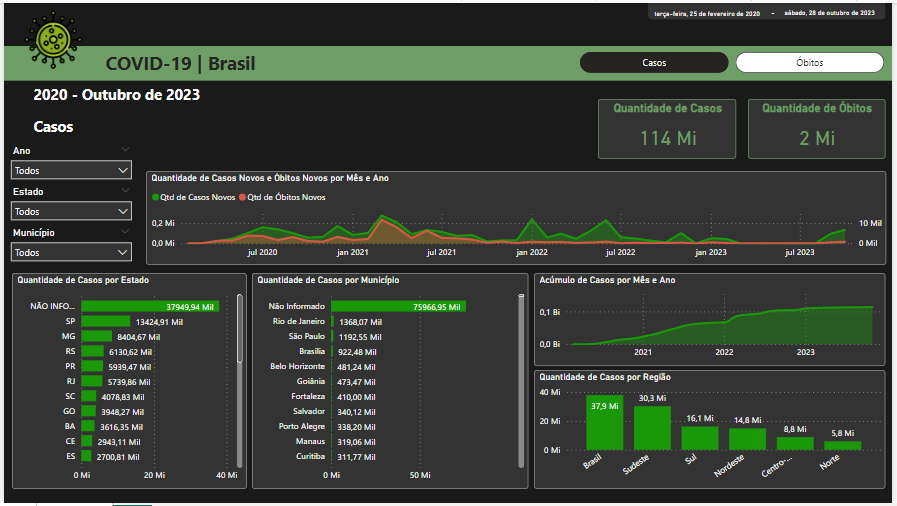
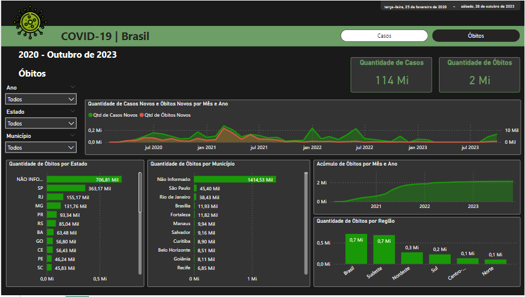

<h1>Repositório de Dashboards feitos em Power BI</h1>

Neste repositório você encontra Dashboards realizados por mim. Em cada pasta está um Dashboard diferente, junto com um README.md com explicações de cada projeto.

<h3>Pastas:</h3>
<ul>
  <li><a href="https://github.com/carolinari/PowerBI/tree/main/RH-funcionarios">Dashboard de RH - Funcionários [DatasetRH]</a></li>
  <li><a href="https://github.com/carolinari/PowerBI/tree/main/RH">Dashboard de RH [RH]</a></li>
  <li><a href="https://github.com/carolinari/PowerBI/tree/main/covid-BR">Dashboard de COVID no Brasil [covid-BR-2020_out2023]</a></li>
  <li><a href="https://github.com/carolinari/PowerBI/tree/main/dashboard-nike">Dashboard Nike [nike]</a></li>
  <li><a href="https://github.com/carolinari/PowerBI/tree/main/netflix">Dashboard Netflix [netflix]</a></li>
  <li><a href="https://github.com/carolinari/PowerBI/tree/main/producao">Dashboard de Produção [producao]</a></li>
  <li><a href="https://github.com/carolinari/PowerBI/tree/main/segmentacao_de_clientes">Dashboard de Segmentação de Clientes com Machine Learning (Python) [segmentos]</a></li>
  <li><a href="https://github.com/carolinari/PowerBI/tree/main/supermarket-sales">Dashboard de Varejo [supermarket-sales]</a></li>
  <li><a href="https://github.com/carolinari/PowerBI/tree/main/vendas">Dashboard de Vendas [vendas]</a></li>
</ul>

<h3>Alguns dashboards:</h3>

   

   

   

   

