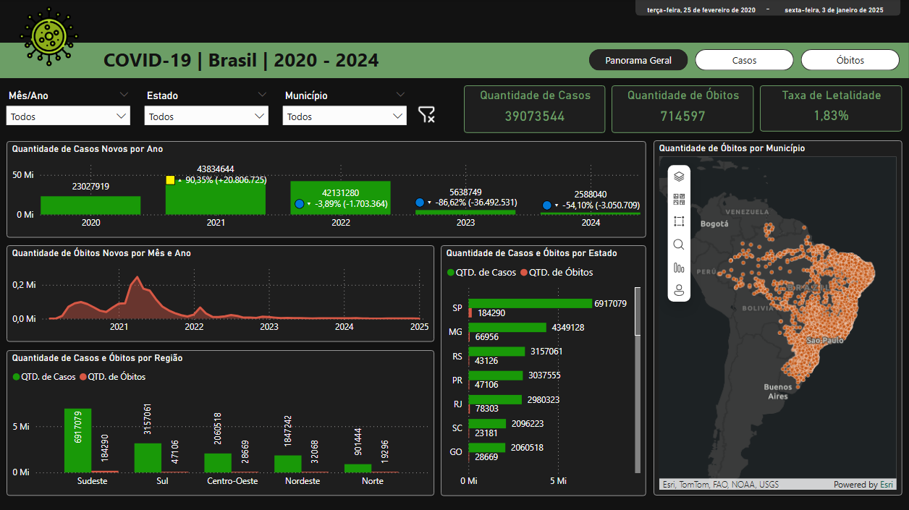
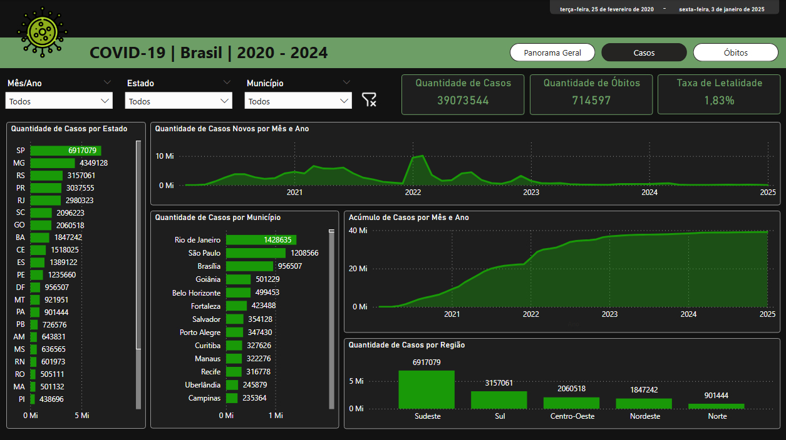
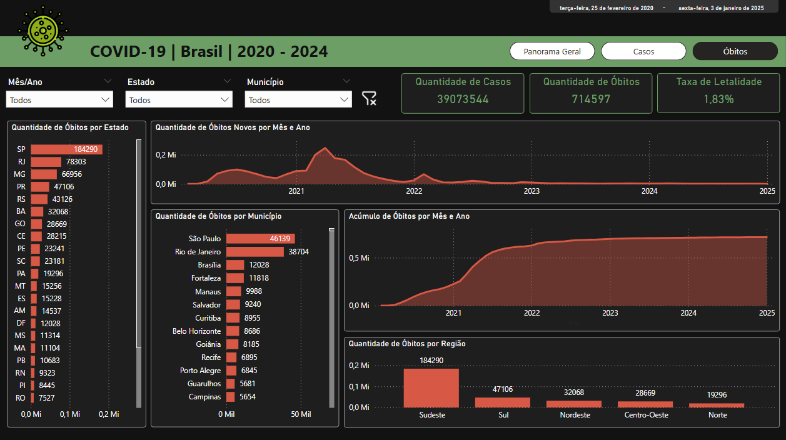

# Dashboard de Covid-19 no Brasil 
- (25 de Fevereiro de 2020 - 03 de Janeiro de 2025)


## Bases de dados
- Fonte: https://covid.saude.gov.br/


## Importar bases de dados
- Problemas com acentuação gráfica
	- Modificar Origem do Arquivo para "65001: Unicode (UTF-8)"


## Juntar bases de dados
- Importar todas as bases de dados
- Power Query: Acrescentar Consultas>Acrescentar Consultas como Novas
- Selecionar "Três ou mais tabelas" > Selecionar e adicionar todas
- Renomear para "covidbr_2020_20231"


## Coluna [estado]
- Substituir valores faltantes por "NÃO INFORMADO"
- Base de dados: covidbr_2020_20231


## Coluna [municipio]
- Substituir valores faltantes por "Não Informado"
- Base de dados: covidbr_2020_20231


## Medidas criadas

- QtdCasosAcumulados = 
```
CALCULATE(
    MAX('covidbr_2020_2023-28out'[casosAcumulado]),
    FILTER(
        'covidbr_2020_2023-28out',
        'covidbr_2020_2023-28out'[data] = 
        MAX('covidbr_2020_2023-28out'[data])
    )
)
```

- QtdObitosAcumulados = 
```
CALCULATE(
    MAX('covidbr_2020_2023-28out'[obitosAcumulado]),
    FILTER(
        'covidbr_2020_2023-28out',
        'covidbr_2020_2023-28out'[data] =
        MAX('covidbr_2020_2023-28out'[data])
    )
)
```


- RotuloCasosNovosPorAno =
```
VAR AnoAtual = SELECTEDVALUE('covidbr_2020_2023-28out'[Ano])

-- Soma dos casos novos no ano atual
VAR ValorAtual =
    CALCULATE(
        SUM('covidbr_2020_2023-28out'[casosNovos]),
        FILTER(
            ALL('covidbr_2020_2023-28out'),
            YEAR('covidbr_2020_2023-28out'[data]) = AnoAtual
        )
    )

-- Soma dos casos novos no ano anterior
VAR AnoAnterior = AnoAtual - 1

VAR ValorAnterior =
    CALCULATE(
        SUM('covidbr_2020_2023-28out'[casosNovos]),
        FILTER(
            ALL('covidbr_2020_2023-28out'),
            YEAR('covidbr_2020_2023-28out'[data]) = AnoAnterior
        )
    )

-- Diferença absoluta e percentual
VAR Diferenca = ValorAtual - ValorAnterior

VAR Percentual =
    IF(
        NOT ISBLANK(ValorAnterior) && ValorAnterior <> 0,
        DIVIDE(Diferenca, ValorAnterior),
        BLANK()
    )

-- Ícone de tendência
VAR Icone =
    SWITCH(
        TRUE(),
        Diferenca > 0, "🟨▴",
        Diferenca < 0, "🔵▾",
        "-"
    )

-- Resultado formatado
RETURN
    IF(
        NOT ISBLANK(Percentual),
        Icone & " " &
        FORMAT(Percentual, "0.00%") & " (" &
        FORMAT(Diferenca, "+#,##0;-#,##0") & ")",
        BLANK()
    )
```

- TaxaDeLetalidade =
```
([QtdObitosAcumulados] / [QtdCasosAcumulados])
```

---

## Imagens das Páginas dos Dashboards

<p>
  
</p>

<p>
  
</p>

<p>
  
</p>