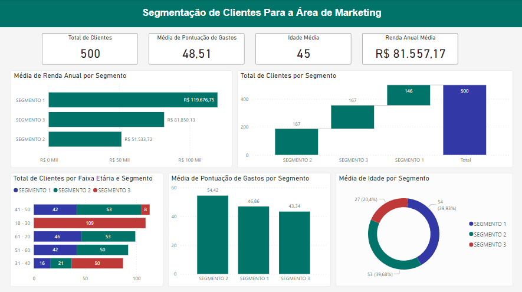

# Dashboard de Segmentação de Clientes
- Agrupamento de clientes com Python
- Machine Learning | K-means
- Layout móvel

# Python
- Machine Learning
- Segmentação de clientes com K-means

# Power BI

## Criação de colunas

### segmento = 
```
if [cluster] = 0 then "SEGMENTO 1"
else if [cluster] = 1 then "SEGMENTO 2"
else "SEGMENTO 3"
```

### faixa_etaria = 
```
if [idade] >= 18 and [idade] <= 30 then "18 - 30"
else if [idade] >= 31 and [idade] <= 40 then "31 - 40"
else if [idade] >= 41 and [idade] <= 50 then "41 - 50"
else if [idade] >= 51 and [idade] <= 60 then "51 - 60"
else "61 - 70"
```

## Medidas criadas
- total_clientes = COUNTROWS('segmentos')

<p align="center">
  <br>
</p>